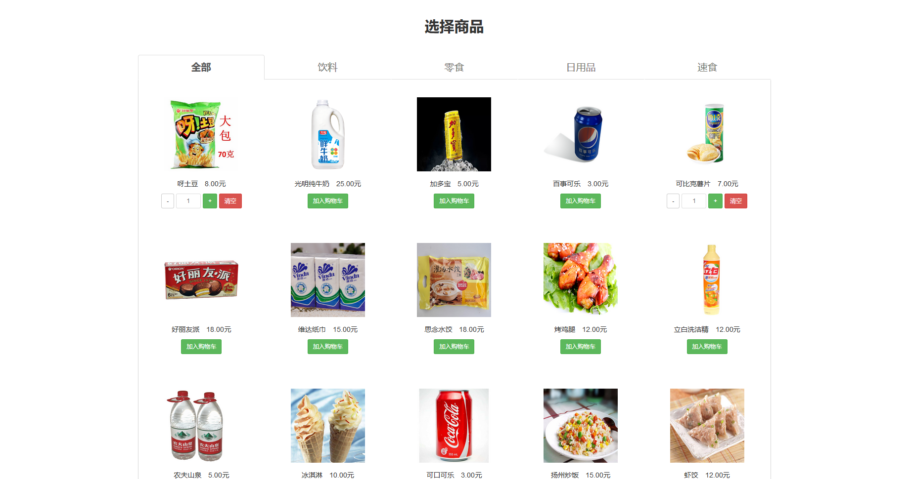
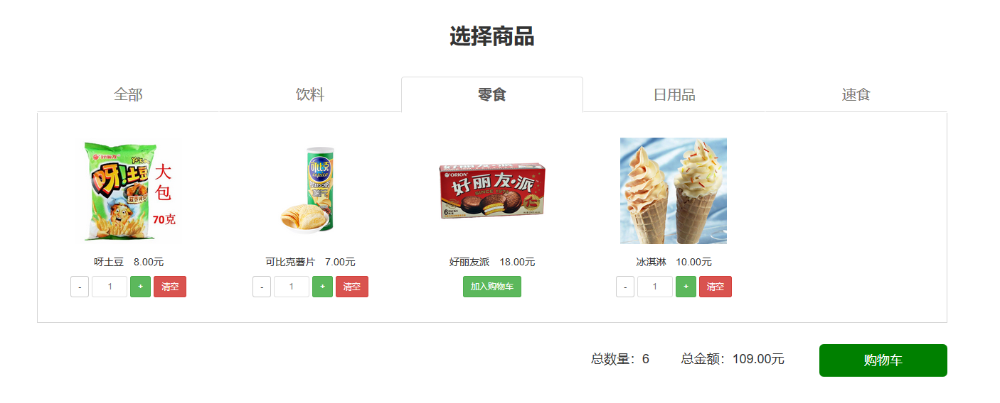
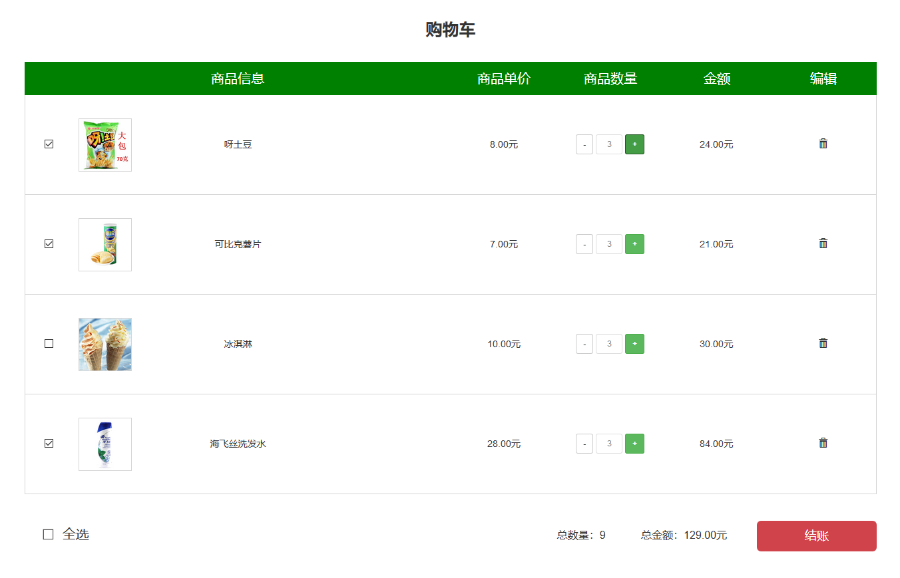
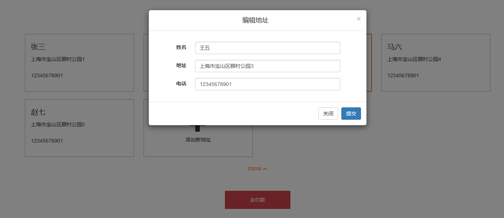
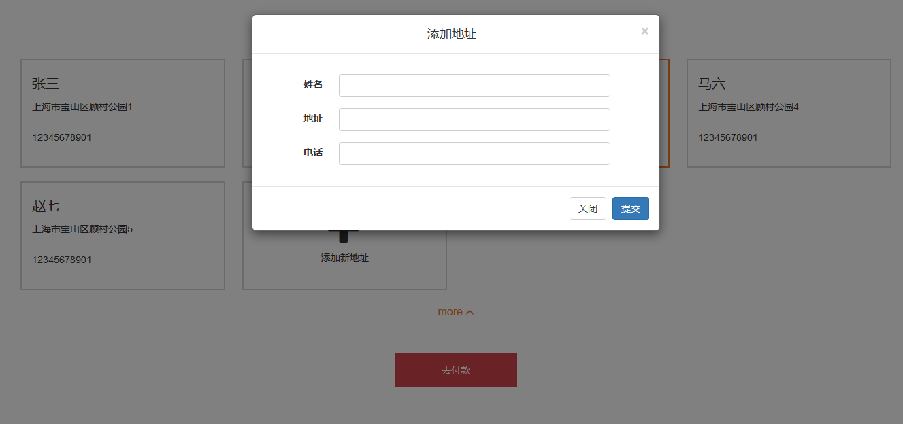

### 页面展示地址：https://mmchao.github.io/shop/dist/   
   
### 路由方案： 商品选择：'/'， 购物车：'/check'， 地址选择：'/address'
   
### 页面效果预览：   
1、商品选择页面  
  
   
  
功能：选择商品、增减数量、显示总数量及金额
  
2、购物车页面  
  
功能：全选、取消全选、删除某件商品、增减数量，通过vuex使购物车与商品选择页面的数据保持同步

3、地址选择页面  
  
  
  
  
  
功能：选择地址、设置默认地址、删除、编辑、添加地址、折叠和打开地址列表
